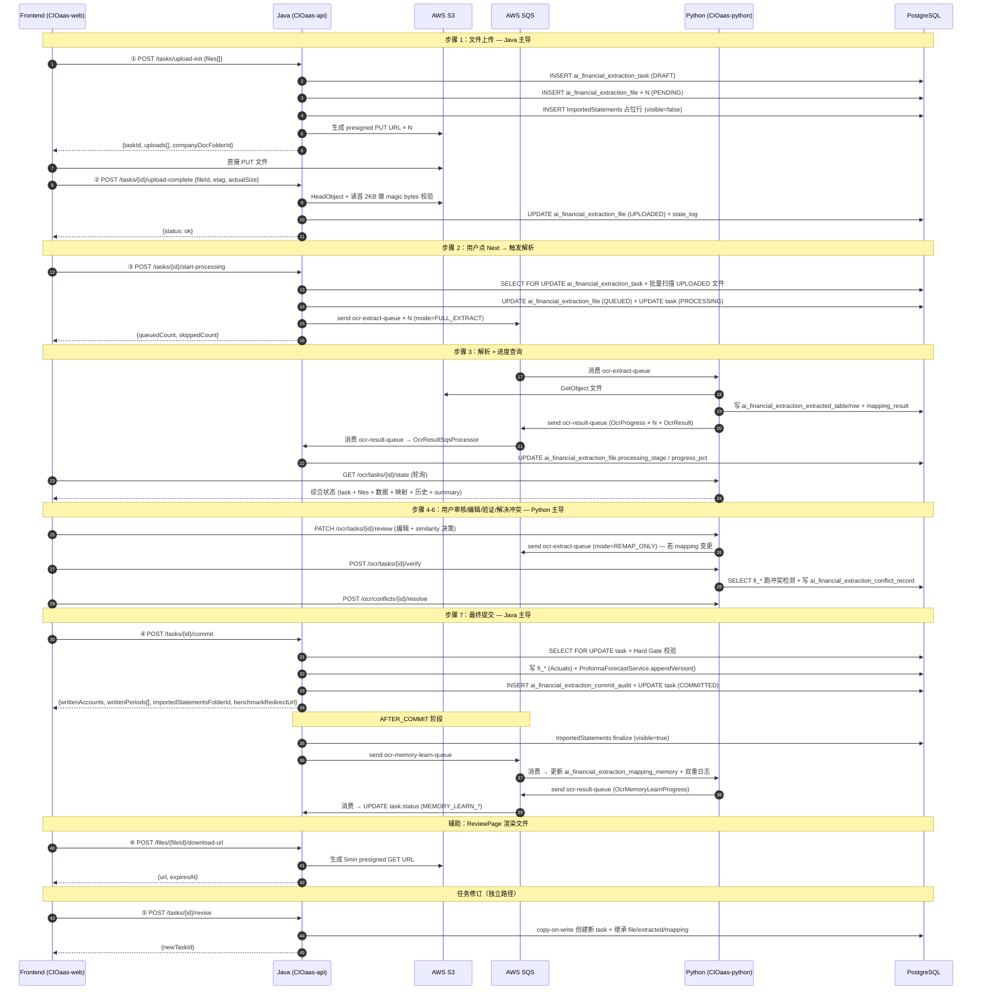

# OCR Agent Java 端设计 (CIOaas-api)

> **技术栈**: Java 17 + Spring Boot 3 + Spring Cloud Gateway + AWS S3/SQS
> **关联文档**: [设计理念](./design-philosophy.md) · [需求分析](./requirement-analysis.md) · [系统架构](./system-architecture.md) · [Python 端设计](./python-design.md) · [前端设计](./frontend-design.md) · [数据库 Schema](./database-schema.md) · [代码示例](./code-examples.md) · [用户输入需求清单](../user-input-requirements.md)

---

## 目录

- [0. 文档定位（v2）](#0-文档定位v2)
- [1. 接口清单（Java 端 6 REST + 3 SQS Producer + 1 回传 Consumer）](#1-接口清单java-端-6-rest--3-sqs-producer--1-回传-consumer)
  - [1.1 REST 端点（用户面向：上传 + 提交）](#11-rest-端点用户面向上传--提交)
  - [1.2 REST 端点（辅助：文件查看）](#12-rest-端点辅助文件查看)
  - [1.3 SQS 出口生产者（Java → Python）](#13-sqs-出口生产者java--python)
  - [1.4 SQS 回传消费者（Python → Java）](#14-sqs-回传消费者python--java按-messagetype-多路复用)
- [1.5 接口流程图（v2 全景）](#15-接口流程图v2-全景)
- [2. REST 端点详情（6 个 — 含业务逻辑 / 逻辑图 / 关联表 / 契约）](#2-rest-端点详情6-个--含业务逻辑--逻辑图--关联表--契约)
  - [2.1 POST /tasks/upload-init](#21-post-tasksupload-init)
  - [2.2 POST /tasks/{id}/upload-complete](#22-post-tasksidupload-complete)
  - [2.3 POST /tasks/{id}/start-processing](#23-post-tasksidstart-processing)
  - [2.4 POST /tasks/{id}/commit](#24-post-tasksidcommit)
  - [2.5 POST /tasks/{id}/revise](#25-post-tasksidrevise)
  - [2.6 POST /files/{fileId}/download-url](#26-post-filesfileiddownload-url)
- [3. SQS 集成（实现层 + 业务详情）](#3-sqs-集成实现层--业务详情)
  - [3.1 OcrExtractSqsProducer（出口 1）](#31-ocrextractsqsproducer出口-1)
  - [3.2 OcrSimilarityCheckSqsProducer（出口 2）](#32-ocrsimilaritychecksqsproducer出口-2)
  - [3.3 OcrMemoryLearnSqsProducer（出口 3）](#33-ocrmemorylearnsqsproducer出口-3)
  - [3.4 OcrResultSqsProcessor（回传消费者，4 个 messageType handler）](#34-ocrresultsqsprocessor回传消费者4-个-messagetype-handler)
  - [3.5 队列配置](#35-队列配置)
  - [3.6 DocParseTaskSweeper（v2 收窄）](#36-docparsetasksweeperv2-收窄)
- [4. 模块结构](#4-模块结构)
  - [4.1 包结构（v2 精简）](#41-包结构v2-精简)
  - [4.2 与现有模块的集成点](#42-与现有模块的集成点)
- [5. 数据表设计（业务语义）](#5-数据表设计业务语义)
  - [5.1 Java 拥有的表（v2 概览）](#51-java-拥有的表v2-概览)
  - [5.2 关键设计决策（v2 保留）](#52-关键设计决策v2-保留)
  - [5.3 Java/Python 数据库物理部署](#53-javapython-数据库物理部署)
- [6. Commit 流程实现层（端点 4 — 核心职责）](#6-commit-流程实现层端点-4--核心职责)
  - [6.1 v2 Commit 端点重大变更](#61-v2-commit-端点重大变更)
  - [6.2 两阶段事务模型](#62-两阶段事务模型)
  - [6.3 关键实现层约束](#63-关键实现层约束)
  - [6.4 Commit 失败的恢复路径](#64-commit-失败的恢复路径)
  - [6.5 ImportedStatementsService 职责（预占位 → 最终化）](#65-importedstatementsservice-职责预占位--最终化)
  - [6.6 边界用例 — 无可提取数据（NO_DATA_BYPASS）](#66-边界用例--无可提取数据no_data_bypass)
- [7. 任务修订实现层（端点 5）](#7-任务修订实现层端点-5)
- [8. 安全要求](#8-安全要求)

---

## 0. 文档定位（v2）

本文档**唯一权威**描述 Java 端的所有对外接口（6 个 REST + 3 个 SQS Producer + 1 个回传 Consumer），覆盖：
- 接口契约（URL / DTO / 字段定义）
- 接口对应的业务逻辑
- 接口逻辑图（前端 → Controller → Service → Repository / S3 / SQS / DB）
- 接口关联的数据库表（INSERT / UPDATE / SELECT 哪些字段）
- 实现层细节（事务边界、并发控制、状态机推进、安全约束）

**v2 边界（2026-05-06）**：
- Java 仅承担"文件上传 + 最终提交"两条核心路径，6 个 REST 端点
- 步骤 3-6（综合状态查询 / 用户编辑 / 冲突验证 / 单冲突解决 / 相似度决策 / 记忆学习状态 / 任务历史链 / mapping 变更检测）**全部由 Python 主导**，前端直接调用 Python 端点 — 详见 [python-design.md](./python-design.md)
- Java ↔ Python 通信仅通过 SQS（不变）
- 详见 [system-architecture.md §0](./system-architecture.md#0-职责边界声明顶层规则)

---

## 1. 接口清单（Java 端 6 REST + 3 SQS Producer + 1 回传 Consumer）

通用约定：
- 所有 REST 端点位于 `/api/v1/docparse` 前缀下
- JWT 认证 + `company_id` 归属校验（强制）
- 返回 `Result<T>` 标准包装（success / data / error）
- 用户可见错误信息均由 Java 生成（R-2.2 约束）

### 1.1 REST 端点（**全部 12 个 REST 端点 — Java + Python 统一索引**）

> 本表是项目所有 REST 端点的全景清单。Java 端 8 个（含本文档详情）+ Python 端 4 个（详情见 [python-design.md](./python-design.md)）。点击「详情」跳转到对应的章节。

| # | URL | 方法 | 端 | 用户步骤 | 一句话职责 | 详情 |
|---:|-----|:---:|:---:|:---:|----------|:---:|
| 1 | `/tasks/upload-init` | POST | Java | 步骤 1 | 创建 task + 申请 S3 presigned PUT URL + 预关联公司文件表占位行 | [→](#21--posttasksupload-init) |
| 2 | `/tasks/{id}/upload-complete` | POST | Java | 步骤 1 | 单文件上传完成（HeadObject + magic bytes 校验） | [→](#22--posttasksidupload-complete) |
| 3 | `/tasks/{id}/files` | GET | Java | 任意步骤 | **任务文件列表查询**（含状态、进度、替换链） | [→](#23--gettasksidfiles--任务文件列表查询) |
| 4 | `/files/{fileId}/replace` | POST | Java | 步骤 1 | **替换文件**（软删旧文件 + 申请新 presigned URL） | [→](#24--postfilesfileidreplace--替换文件) |
| 5 | `/tasks/{id}/start-processing` | POST | Java | 步骤 2 | 点 Next 触发批量入队 | [→](#25--posttasksidstart-processing) |
| 6 | `/tasks/{id}/commit` | POST | Java | 步骤 7 | 写 fi_* + 触发记忆 SQS + 返回 Benchmark URL | [→](#26--posttasksidcommit) |
| 7 | `/tasks/{id}/revise` | POST | Java | — | 任务修订：copy-on-write 创建新批次 | [→](#27--posttasksidrevise) |
| 8 | `/files/{fileId}/download-url` | POST | Java | 辅助 | ReviewPage 渲染 PDF/Excel 时申请 5 min S3 presigned GET URL | [→](#28--postfilesfileiddownload-url) |
| 9 | `/ocr/tasks/{id}/state` | GET | Python | 步骤 3/5 | 综合状态聚合（task + 文件 + 数据 + 映射 + 相似度 + 记忆 + 历史 + summary） | [→ python-design.md](./python-design.md#21-端点-1--ocrtasksidstate-get) |
| 10 | `/ocr/tasks/{id}/review` | PATCH | Python | 步骤 4 | 客户变更：编辑 row/mapping + note + 自动 mapping 变更检测 + 相似度决策 | [→ python-design.md](./python-design.md#22-端点-2--ocrtasksidreview-patch) |
| 11 | `/ocr/tasks/{id}/verify` | POST | Python | 步骤 6 | 启动验证：跨域读 fi_* 跑冲突检测 → 写 `ai_financial_extraction_conflict_record` | [→ python-design.md](./python-design.md#23-端点-3--ocrtasksidverify-post) |
| 12 | `/ocr/conflicts/{id}/resolve` | POST | Python | 步骤 6 | 单冲突解决（note 必填，自动写 thread） | [→ python-design.md](./python-design.md#24-端点-4--ocrconflictsidresolve-post) |

### 1.3 SQS 出口生产者（Java → Python）

| 队列 | Producer 类 | 触发场景 | 一句话职责 |
|------|-------------|---------|----------|
| `ocr-extract-queue` | `OcrExtractSqsProducer` | 步骤 3：用户点 Next 后由 `start-processing` 端点批量入队 | 触发 OCR + AI 提取 + AI 映射；`mode` 字段区分 `FULL_EXTRACT` / `REMAP_ONLY` |
| `ocr-similarity-check-queue` | `OcrSimilarityCheckSqsProducer` | 内部辅助：所有文件 REVIEW_READY 后由 `OcrResultSqsProcessor` 通过 `TaskReadyForReviewEvent` 派发 | 触发 embedding + KNN 相似度检测 |
| `ocr-memory-learn-queue` | `OcrMemoryLearnSqsProducer` | 步骤 7：`commit` 端点 AFTER_COMMIT 入队 | 触发记忆学习更新 mapping_memory |

> `REMAP_ONLY` 入队由 Python `/review` 端点检测 mapping 变更后内部完成（Python 也是 `ocr-extract-queue` 的 producer，通过 boto3 共享 SQS API）。Java 不再承担 navigate-back 端点。

### 1.4 SQS 回传消费者（Python → Java，按 messageType 多路复用）

> 单一队列 `ocr-result-queue`；4 个 messageType 分发到 `OcrResultSqsProcessor` 4 个 handler。

| messageType | Handler | 一句话职责 |
|-------------|---------|----------|
| `OcrProgress` | `OcrResultSqsProcessor#handleProgress` | 文件级精细进度上报（每个 stage 一条） |
| `OcrResult` | `OcrResultSqsProcessor#handleResult` | 单文件最终结果上报 |
| `OcrSimilarityCheckResult` | `OcrResultSqsProcessor#handleSimilarityCheckResult` | 相似度检测完成回执 |
| `OcrMemoryLearnProgress` | `OcrResultSqsProcessor#handleMemoryLearnProgress` | 记忆学习进度回报 |

---

## 1.5 接口流程图（v2 全景）

下图横轴：Frontend / Java / Python / SQS / DB / S3；纵轴：4 步流程的时间顺序。突出 Java 端 6 个 REST 接口在整个流程中的位置。



---

## 2. REST 端点详情（8 个 — 含业务逻辑 / 逻辑图 / 关联表 / 契约）

### 2.1 POST /tasks/upload-init

> 步骤 1 入口：一站式创建 task + 申请 S3 presigned PUT URL + 预关联公司文件表占位行。

**支持的业务逻辑**：
- JWT + company 归属校验
- 创建 `ai_financial_extraction_task`（status=DRAFT，24h 后过期）
- 对每个 file 逐项预校验（部分失败不阻断其余文件）：
  - 单文件大小 ≤ 20MB；批次累计 ≤ 100MB
  - 扩展名 + Content-Type 白名单（PDF / XLSX / CSV / JPG / PNG / TIFF）
  - SHA-256 hash 重名查询：UNIQUE `(company_id, file_hash) WHERE deleted=false AND status!='FILE_FAILED'`
- 合法文件 → 创建 `ai_financial_extraction_file`（status=PENDING）+ 生成 S3 presigned PUT URL（15 min 有效）
- **预关联公司文件表（v2 新增）**：在 Documents 服务的 "Imported Statements/{taskUuid}/" 文件夹下创建占位行（visible=false），供用户在上传过程中即可在 Documents 视图看到"导入中"批次
- 写 `ai_financial_extraction_task_state_log` (event_type=`UPLOAD_INITIATED`)

**逻辑图**：

```
[Frontend]
   │ POST /tasks/upload-init {files[]: {filename, fileSize, contentType, sha256}}
   ▼
[UploadController#initUpload]
   │ JWT + company 归属校验
   ▼
[UploadInitService] (@Transactional)
   ├──→ [DocParseTaskRepository] INSERT ai_financial_extraction_task (DRAFT)
   ├──→ FOR EACH file:
   │    ├─ 校验 size / 扩展名 / Content-Type / hash
   │    ├──→ [DocParseFileRepository] INSERT ai_financial_extraction_file (PENDING)
   │    └──→ [S3PresignedUrlClient] generate PUT URL (15 min)
   ├──→ [ImportedStatementsService#createPlaceholder]
   │    └──→ [CompanyDocService] 创建占位文件夹 + 占位文件行 (visible=false)
   ├──→ INSERT ai_financial_extraction_task_state_log (UPLOAD_INITIATED)
   ▼
{taskId, uploads[], companyDocFolderId}
```

**关联的表**：
- `ai_financial_extraction_task` — INSERT：`id`, `company_id`, `uploaded_by`, `status=DRAFT`, `expires_at=NOW()+24h`
- `ai_financial_extraction_file` — INSERT × N：`id`, `task_id`, `filename`, `file_size`, `content_type`, `file_hash`, `s3_key`, `status=PENDING`
- `ai_financial_extraction_task_state_log` — INSERT：`event_type=UPLOAD_INITIATED`, `payload={fileCount, totalSize}`
- 公司文件表（`documents` 模块）— INSERT：占位文件夹 + 占位文件行（visible=false）

**接口契约**：
- Controller: `UploadController#initUpload`
- 请求 DTO: `UploadInitReqVo` — `files[]: {filename, fileSize, contentType, sha256}`
- 响应 DTO: `UploadInitRespVo` — `taskId, uploads[]: {fileId, presignedUrl, expiresAt, error?}, companyDocFolderId`
- S3 Key 命名：`ocr-uploads/{companyId}/{taskId}/{fileId}/{hash}.ext`（含 companyId 保证 IAM 按 prefix 隔离）

---

### 2.2 POST /tasks/{id}/upload-complete

> 单文件上传完成回调：S3 HeadObject 验证 + magic bytes 双重校验。

**支持的业务逻辑**：
- JWT + task.company_id 归属校验
- ⚠️ 安全：从 `ai_financial_extraction_file` 表查 s3Key，**不信任前端传入**（防伪造）
- `s3:HeadObject` 验证对象存在 + ETag/actualSize 一致
- 读取首 2KB 做 MIME + magic bytes 双重校验（防扩展名伪装攻击）
- 通过 → `ai_financial_extraction_file.status=UPLOADED` + 更新 ImportedStatements 占位行的真实 s3_key
- 失败 → `s3:DeleteObject` 清理 + `ai_financial_extraction_file.status=FILE_FAILED` + 错误码（详见错误码表）
- ⚠️ 关键变更（v2）：**不入队** `ocr-extract-queue`，入队动作由 §2.3 `/start-processing` 端点统一触发

**逻辑图**：

```
[Frontend]
   │ (前端已 PUT 文件到 S3 拿到 ETag)
   │ POST /tasks/{id}/upload-complete {fileId, etag, actualSize}
   ▼
[UploadController#completeUpload]
   │ JWT + task.company_id 归属校验
   ▼
[UploadCompleteService] (@Transactional)
   ├──→ [DocParseFileRepository] SELECT s3_key  ← 不信任前端
   ├──→ [S3PresignedUrlClient] HeadObject (验证 ETag + actualSize)
   ├──→ 读首 2KB → magic bytes 校验
   ├─ 通过：
   │    ├──→ UPDATE ai_financial_extraction_file (status=UPLOADED)
   │    ├──→ INSERT ai_financial_extraction_task_state_log (UPLOAD_S3_PERSISTED)
   │    └──→ [ImportedStatementsService#bindActualS3Key] 更新占位行
   └─ 失败：
        ├──→ [S3PresignedUrlClient] DeleteObject (清理 S3)
        ├──→ UPDATE ai_financial_extraction_file (status=FILE_FAILED, error_code)
        └──→ INSERT ai_financial_extraction_task_state_log (UPLOAD_REJECTED)
   ▼
{status: "ok" | "rejected", error?: {code, message}}
```

**关联的表**：
- `ai_financial_extraction_file` — SELECT (s3_key) / UPDATE：`status` (UPLOADED 或 FILE_FAILED), `etag`, `actual_size`, `error_code?`
- `ai_financial_extraction_task_state_log` — INSERT：`event_type=UPLOAD_S3_PERSISTED` 或 `UPLOAD_REJECTED`
- 公司文件表 — UPDATE：占位行的真实 `s3_key`（成功时）

**接口契约**：
- Controller: `UploadController#completeUpload`
- 请求 DTO: `UploadCompleteReqVo` — `fileId, etag, actualSize`
- 响应 DTO: `UploadCompleteRespVo` — `status, error?: {code, message}`
- 错误码：`S3_OBJECT_NOT_FOUND` / `MAGIC_BYTES_MISMATCH` / `UNSUPPORTED_TYPE` / `FILE_TOO_LARGE`（详见 §8 错误码总表）

---

### 2.3 GET /tasks/{id}/files — 任务文件列表查询

**支持的业务逻辑**：
- **用户场景**：在上传页 / 进度页 / 审核页都需要显示当前 task 下的所有文件状态（含已上传 / 处理中 / 已 review_ready / 失败 / 已替换的）
- 返回**全量**文件信息（含已软删除的，便于审计 + 显示替换链），按 `created_at` 排序
- 已替换的旧文件单独标注（`deleted=true` + `replaced_by_file_id` 非空）
- 不返回 S3 临时 URL（如需下载请走 §2.8 `/files/{fileId}/download-url`）

**逻辑图**：

```
[Frontend]
   │ GET /tasks/{id}/files
   ▼
[FileListController#listFiles]
   │ JWT 验证 + companyId 归属校验
   ▼
[DocParseFileService#listByTaskId]
   │ SELECT * FROM ai_financial_extraction_file WHERE task_id=? ORDER BY created_at
   ▼
[DocParseFileRepository]
   │ JPA 查询
   ▼
[ai_financial_extraction_file 表]
   │ 含 deleted/replaced_by_file_id/imported_statements_synced 等
   ▼
[Response: TaskFilesRespVo {files[], total, replacedCount}]
```

**关联的表**：
- `ai_financial_extraction_file` — SELECT 全字段（id, filename, file_type, file_size, file_hash, status, processing_stage, progress_pct, stage_detail, upload_error, error_message, deleted, replaced_by_file_id, imported_statements_synced, synced_at, created_at, updated_at）
- `ai_financial_extraction_task` — SELECT（仅校验 company_id 归属，不返回）

**接口契约**：
- **Controller**: `FileListController#listFiles`
- **请求**: 路径参数 `taskId`；可选 query 参数 `includeDeleted: bool=true / activeOnly: bool=false`
- **响应**: `TaskFilesRespVo`
  ```
  {
    "taskId": "uuid",
    "files": [
      {
        "fileId": "uuid",
        "filename": "p&l_2024.pdf",
        "fileType": "PDF",
        "fileSize": 1234567,
        "fileHash": "sha256...",
        "status": "REVIEW_READY",
        "processingStage": "REVIEW_READY",
        "progressPct": 100,
        "stageDetail": {...},
        "uploadError": null,
        "errorMessage": null,
        "deleted": false,
        "replacedByFileId": null,
        "importedStatementsSynced": false,
        "createdAt": "2026-05-06T10:30:00Z",
        "updatedAt": "2026-05-06T10:35:12Z"
      }
    ],
    "total": 3,
    "activeCount": 2,
    "replacedCount": 1,
    "failedCount": 0
  }
  ```
- **失败**: 404 task 不存在 / 403 跨 company

---

### 2.4 POST /files/{fileId}/replace — 替换文件

**支持的业务逻辑**：
- **用户场景**：用户上传错误文件（错版本、错文件），希望在 task 进入 PROCESSING **之前**替换；或某文件解析失败（FILE_FAILED）想换一个版本重传
- **替换策略**：保留原文件审计链 — 旧文件 `deleted=true` + `replaced_by_file_id=newFileId`，新文件作为独立行（不重用 fileId）
- **前置条件**：
  - 旧文件必须属于当前用户 company
  - 旧文件 `status` ∈ {PENDING, UPLOADED, FILE_FAILED}（**不允许** QUEUED/PROCESSING/REVIEW_READY 之后替换 — 此时已有下游数据）
  - task.status 必须 ∈ {DRAFT, UPLOAD_COMPLETE}（PROCESSING 之后禁止）
  - 新文件经过相同的预校验（大小 / 扩展名 / SHA-256 重名）
- **后置动作**：返回新 fileId 的 presigned PUT URL，前端用此 URL 上传新文件，之后调 `/upload-complete` 完成

**逻辑图**：

```
[Frontend]
   │ POST /files/{fileId}/replace {filename, fileSize, contentType, sha256}
   ▼
[FileReplaceController#replaceFile]
   │ JWT 验证 + companyId 归属校验
   ▼
[FileReplaceService#replace]
   │ ① SELECT FOR UPDATE old_file + 校验 status 允许替换
   │ ② 校验 task.status 允许替换
   │ ③ 预校验新文件（大小 / 扩展名 / SHA-256 唯一性）
   ▼
[事务开始]
   │ ④ INSERT new ai_financial_extraction_file (PENDING)
   │ ⑤ UPDATE old ai_financial_extraction_file SET deleted=true, replaced_by_file_id=newId
   │ ⑥ INSERT ai_financial_extraction_task_state_log (event_type=FILE_REPLACED, snapshot{oldFileId, newFileId})
[事务结束]
   ▼
[S3PresignedUrlClient#generatePutUrl]
   │ 生成新 fileId 的 presigned PUT URL（15 min）
   ▼
[Response: ReplaceRespVo {newFileId, presignedUrl, expiresAt}]
   ▼
前端 PUT 文件到 S3，之后调 §2.2 /upload-complete
```

**关联的表**：
- `ai_financial_extraction_file` — SELECT FOR UPDATE old; INSERT new (PENDING); UPDATE old.deleted=true + old.replaced_by_file_id
- `ai_financial_extraction_task` — SELECT（校验 company_id + status 允许替换）
- `ai_financial_extraction_task_state_log` — INSERT (event_type=FILE_REPLACED)

**接口契约**：
- **Controller**: `FileReplaceController#replaceFile`
- **请求**: `FileReplaceReqVo`
  ```
  {
    "filename": "p&l_2024_v2.pdf",
    "fileSize": 1234567,
    "contentType": "application/pdf",
    "sha256": "..."
  }
  ```
- **响应**: `FileReplaceRespVo`
  ```
  {
    "newFileId": "uuid",
    "oldFileId": "uuid",
    "presignedUrl": "https://...",
    "expiresAt": "2026-05-06T10:45:00Z"
  }
  ```
- **失败**:
  - 409: 旧文件 status 不允许替换（已 QUEUED 之后）/ task.status 不允许替换（PROCESSING 之后）
  - 403: 跨 company
  - 422: 新文件预校验失败（同 SHA-256 已存在 / 大小超限）

---

### 2.5 POST /tasks/{id}/start-processing

> 用户点 "Next" 后批量触发所有 UPLOADED 文件入队解析。**v2 新增端点**，替代 v1 隐式逐文件入队。

**支持的业务逻辑**：
- JWT + task.company_id 归属校验
- `SELECT ... FOR UPDATE` 锁 `ai_financial_extraction_task` 行 → 防止用户重复点 Next 并发触发
- CAS 校验：`task.status IN (DRAFT, UPLOAD_COMPLETE) → PROCESSING`；非法状态抛 `INVALID_STATUS_FOR_PROCESSING`
- 批量扫描所有 `ai_financial_extraction_file.status=UPLOADED` 的文件
- 每个文件入队 `ocr-extract-queue`（`mode=FULL_EXTRACT`，每文件 1 条消息）
- SQS 入队**在事务内**（不 AFTER_COMMIT）—— 失败则整个事务回滚，保证"看到 file.status=QUEUED 时一定已经入队"
- 幂等保护：CAS 推进 task.status；即使重复入队，Python extract_consumer 也通过 `ai_financial_extraction_file.status=PROCESSING/REVIEW_READY` 判定丢弃
- 写 `ai_financial_extraction_task_state_log` (event_type=`START_PROCESSING`, payload={queuedCount, skippedCount})

**逻辑图**：

```
[Frontend]
   │ (用户在上传页面点 Next)
   │ POST /tasks/{id}/start-processing
   ▼
[UploadController#startProcessing]
   │ JWT + task.company_id 归属校验
   ▼
[StartProcessingService] (@Transactional + FOR UPDATE)
   ├──→ SELECT FOR UPDATE ai_financial_extraction_task
   ├──→ CAS：status IN (DRAFT, UPLOAD_COMPLETE) → PROCESSING
   ├──→ SELECT ai_financial_extraction_file WHERE task_id=? AND status='UPLOADED'
   ├──→ FOR EACH UPLOADED file:
   │    ├──→ UPDATE ai_financial_extraction_file (status=QUEUED)
   │    ├──→ [OcrExtractSqsProducer#send] (taskId, fileId, mode=FULL_EXTRACT)
   │    │       ↓
   │    │   [SQS: ocr-extract-queue]
   │    └──→ INSERT ai_financial_extraction_task_state_log (EXTRACT_QUEUED)
   ├──→ INSERT ai_financial_extraction_task_state_log (START_PROCESSING, payload)
   ▼
{queuedCount, skippedCount}
```

**关联的表**：
- `ai_financial_extraction_task` — SELECT FOR UPDATE / UPDATE：`status` (DRAFT/UPLOAD_COMPLETE → PROCESSING)
- `ai_financial_extraction_file` — SELECT (WHERE status=UPLOADED) / UPDATE × N：`status` (UPLOADED → QUEUED)
- `ai_financial_extraction_task_state_log` — INSERT × (N+1)：每文件一条 `EXTRACT_QUEUED` + 一条 `START_PROCESSING`

**接口契约**：
- Controller: `UploadController#startProcessing`
- 请求 DTO: `StartProcessingReqVo` — 空 body 或 `force?: bool`
- 响应 DTO: `StartProcessingRespVo` — `queuedCount, skippedCount`
- 错误码：`INVALID_STATUS_FOR_PROCESSING`（task 已在跑或已完成）

---

### 2.6 POST /tasks/{id}/commit

> 步骤 7 终结点：写 fi_* 财务表 + AFTER_COMMIT 触发记忆 SQS + 最终化 Imported Statements + 返回 Benchmark 跳转 URL。

**支持的业务逻辑**：
- `SELECT ... FOR UPDATE` 锁 `ai_financial_extraction_task` 行 → 防并发 Commit
- CAS 校验：`status IN (REVIEWING, CONFLICT_RESOLUTION, READY_TO_COMMIT) → COMMITTING`
- **Hard Gate 二次校验**（防绕过）：
  - Python `/verify` 已跑且无 PENDING 冲突
  - 所有 row 都有 lg_category（unmapped 拒绝）
  - 任一失败 → 抛 `HARD_GATE_FAILED` + 回滚
- 读 `ai_financial_extraction_extracted_row` + `ai_financial_extraction_mapping_result`（跨 schema SELECT，Java 对 Python 拥有的表只读）
- 按 resolution 策略写 `fi_*` 财务表（Actuals）+ 调 `ProformaForecastService.appendVersion()`（Proforma）
- 写 `ai_financial_extraction_commit_audit`（written/overwritten/skipped + 关联 conflict_note_id）
- task.status=COMMITTED；files.status=FILE_COMMITTED
- 若是 revision：parent.status=SUPERSEDED + parent.superseded_by=self.id
- 构建 `benchmarkRedirectUrl`（前端直接跳转用，不再有独立 `/commit/result` 端点）
- **AFTER_COMMIT 阶段**（@TransactionalEventListener(phase=AFTER_COMMIT)）：
  - `ImportedStatementsService.finalize(taskId)`：所有 visible=false 的占位行设为 visible=true
  - 触发下游 normalization 流程（@Async）
  - 检测新 closed month → `ClosedMonthMailService.notify()` + 写 state_log NEW_CLOSED_MONTH
  - 构建 mappingComparisons → `OcrMemoryLearnSqsProducer.send(...)`
  - task.status=MEMORY_LEARN_PENDING
  - 写 state_log COMMIT_COMPLETE

**逻辑图**：

```
[Frontend]
   │ POST /tasks/{id}/commit {confirmFinal: true}
   ▼
[CommitController#commit]
   │ JWT + task.company_id 归属校验
   ▼
[CommitService] (@Transactional + FOR UPDATE)
   ├──→ SELECT FOR UPDATE ai_financial_extraction_task
   ├──→ CAS → status=COMMITTING
   ├──→ Hard Gate 校验（无 PENDING 冲突 + 全部 mapped）
   ├──→ SELECT ai_financial_extraction_extracted_row + ai_financial_extraction_mapping_result
   ├──→ 写 fi_* (Actuals) + [ProformaForecastService#appendVersion]
   ├──→ INSERT ai_financial_extraction_commit_audit
   ├──→ UPDATE ai_financial_extraction_task (COMMITTED) + UPDATE ai_financial_extraction_file × N (FILE_COMMITTED)
   ├──→ [BenchmarkRedirectService#buildUrl]
   ├──→ publishEvent(CommitSuccessEvent)
   ▼
{writtenAccounts, writtenPeriods[], importedStatementsFolderId, benchmarkRedirectUrl}

[AFTER_COMMIT @TransactionalEventListener]
   ├──→ [ImportedStatementsService#finalize] visible=true
   ├──→ [ClosedMonthMailService#notify] (新 closed month)
   ├──→ [OcrMemoryLearnSqsProducer#send] → [SQS: ocr-memory-learn-queue]
   ├──→ UPDATE ai_financial_extraction_task (MEMORY_LEARN_PENDING)
   └──→ INSERT ai_financial_extraction_task_state_log (COMMIT_COMPLETE)
```

**关联的表**：
- `ai_financial_extraction_task` — SELECT FOR UPDATE / UPDATE：`status` (REVIEWING/CONFLICT_RESOLUTION/READY_TO_COMMIT → COMMITTING → COMMITTED → MEMORY_LEARN_PENDING)
- `ai_financial_extraction_file` — UPDATE × N：`status=FILE_COMMITTED`
- `ai_financial_extraction_extracted_row` — SELECT（跨域只读）
- `ai_financial_extraction_mapping_result` — SELECT（跨域只读）
- `ai_financial_extraction_conflict_record` — SELECT（验证无 PENDING 冲突）
- `ai_financial_extraction_commit_audit` — INSERT：`written / overwritten / skipped` + `conflict_note_id` 关联
- `fi_*` 财务表 — INSERT/UPDATE（Actuals）；通过 `ProformaForecastService.appendVersion()` 间接处理 Proforma
- `ai_financial_extraction_task_state_log` — INSERT：`COMMIT_COMPLETE` / `NEW_CLOSED_MONTH`
- 公司文件表 — UPDATE：占位行 `visible=true`（AFTER_COMMIT）

**接口契约**：
- Controller: `CommitController#commit`
- 请求 DTO: `CommitReqVo` — `confirmFinal: bool`（hard gate 二次确认）
- 响应 DTO: `CommitRespVo` — `writtenAccounts: int, writtenPeriods: string[], importedStatementsFolderId: string, benchmarkRedirectUrl: string`
- 错误码：`HARD_GATE_FAILED` / `INVALID_STATUS_FOR_COMMIT` / `COMMIT_FAILED_RETRYABLE`

---

### 2.7 POST /tasks/{id}/revise

> 任务修订：基于已 COMPLETED/SUPERSEDED task 创建新批次（copy-on-write）。

**支持的业务逻辑**：
- JWT + company 归属校验
- 校验 parent task.status ∈ {COMPLETED, SUPERSEDED}
- 新 task 沿用 parent 的 `s3_key`（不重新上传文件，仅 COPY `ai_financial_extraction_file` 行）
- copy-on-write 继承：
  - `ai_financial_extraction_extracted_table/row` 由 Java 直接 COPY（v2：Java 写入 Python 拥有的表的单向例外，仅 revise 场景）
  - `ai_financial_extraction_mapping_result` 由 Java 直接 INSERT
- `revision_number = parent.revision_number + 1`，受 UNIQUE `(parent_task_id, revision_number)` 约束保护并发
- 新 task.status=DRAFT；用户在新批次中重新走 4 步流程
- Commit 成功后置 parent.status=SUPERSEDED + parent.superseded_by=self.id（在 commit 事务步骤处理）
- 修订原因记录到 `ai_financial_extraction_task.revision_reason`
- Cancel 选项已移除（Asana 2026-04-19）—— 用户若放弃直接退出页面，Sweeper 24h 后清 DRAFT

**逻辑图**：

```
[Frontend]
   │ POST /tasks/{id}/revise {reason}
   ▼
[ReviseController#reviseTask]
   │ JWT + parent task.company_id 归属校验
   ▼
[ReviseService] (@Transactional)
   ├──→ SELECT parent ai_financial_extraction_task (status IN COMPLETED/SUPERSEDED)
   ├──→ INSERT ai_financial_extraction_task (parent_task_id, revision_number+1, status=DRAFT, revision_reason)
   ├──→ COPY ai_financial_extraction_file × N (沿用 s3_key)
   ├──→ COPY ai_financial_extraction_extracted_table/row × N
   ├──→ COPY ai_financial_extraction_mapping_result × N
   ├──→ INSERT ai_financial_extraction_task_state_log (REVISION_CREATED)
   ▼
{newTaskId}
```

**关联的表**：
- `ai_financial_extraction_task` — SELECT (parent) / INSERT (new revision)：`parent_task_id`, `revision_number`, `revision_reason`, `status=DRAFT`
- `ai_financial_extraction_file` — COPY × N：沿用 `s3_key`，新 `task_id`
- `ai_financial_extraction_extracted_table` / `ai_financial_extraction_extracted_row` — COPY × N（跨域 INSERT 例外）
- `ai_financial_extraction_mapping_result` — INSERT × N（跨域 INSERT 例外）
- `ai_financial_extraction_task_state_log` — INSERT：`REVISION_CREATED`

**接口契约**：
- Controller: `ReviseController#reviseTask`
- 请求 DTO: `ReviseReqVo` — `reason: string`
- 响应 DTO: `ReviseRespVo` — `newTaskId: string`
- 错误码：`PARENT_TASK_INVALID_STATUS`（parent 不在 COMPLETED/SUPERSEDED）

---

### 2.8 POST /files/{fileId}/download-url

> ReviewPage 渲染 PDF/Excel 时申请 5 min S3 presigned GET URL。

**支持的业务逻辑**：
- JWT + company 归属校验
- 校验 `ai_financial_extraction_file.deleted=false` AND `status NOT IN (FILE_FAILED, PENDING)`
- 生成 S3 presigned GET URL（生存期 **5 分钟**，比 PUT 的 15 min 更短，安全收紧）
- **不附加** `Content-Disposition: attachment` —— 让浏览器直接预览
- 前端用此 URL：PDF/图片直接 `<iframe>` 或 `` 渲染；Excel 由前端用 SheetJS 拉取后解析

**逻辑图**：

```
[Frontend]
   │ (ReviewPage 加载文件)
   │ POST /files/{fileId}/download-url
   ▼
[FileViewController#getDownloadUrl]
   │ JWT + company 归属校验
   ▼
[Service]
   ├──→ SELECT ai_financial_extraction_file (校验 status + deleted)
   ├──→ [S3PresignedUrlClient] generate GET URL (5 min, signatureDuration)
   ▼
{url, expiresAt}
```

**关联的表**：
- `ai_financial_extraction_file` — SELECT：`s3_key`, `status`, `deleted`, `company_id`（用于归属校验）

**接口契约**：
- Controller: `FileViewController#getDownloadUrl`
- 请求 DTO: 无 body（fileId 来自 path）
- 响应 DTO: `FileDownloadUrlRespVo` — `url: string, expiresAt: ISO8601 datetime`
- 错误码：`FILE_NOT_FOUND` / `FILE_DELETED` / `FILE_NOT_READABLE`（status PENDING/FAILED）

---

## 3. SQS 集成（实现层 + 业务详情）

### 3.1 OcrExtractSqsProducer（出口 1）

**支持的业务逻辑**：
- 一条消息对应一个文件（不是一个 task）—— 独立重试、天然并发、部分失败隔离
- `mode` 字段路由：
  - `FULL_EXTRACT`：首次上传，由 `/start-processing` 触发，全量走 Preprocess→Extract→Classify→Map→Validate（约 30-60s）
  - `REMAP_ONLY`：mapping 变更，**由 Python `/review` 端点检测后内部入队**（Python 通过 boto3 共享 SQS API，仅重跑 Map 节点，约 1-10s）
- HMAC-SHA256 签名（消息防伪造，详见 §8.3）

**逻辑图**：

```
[/start-processing 端点]
   │ FOR EACH UPLOADED file
   ▼
[OcrExtractSqsProducer#send]
   ├──→ 构建 OcrExtractMessage {messageType=OcrExtract, mode=FULL_EXTRACT, taskId, fileId, companyId, s3Bucket, s3Key, ...}
   ├──→ 计算 HMAC-SHA256 签名 → hmacSignature 字段
   ├──→ AWS SDK send_message → ocr-extract-queue
   ▼
[Python extract_consumer.py#handle_extract_message]
```

**关联的表**：
- 触发前：`ai_financial_extraction_file` (SELECT WHERE status=UPLOADED)
- 触发同事务内：`ai_financial_extraction_file` UPDATE (status=QUEUED) + `ai_financial_extraction_task_state_log` INSERT (EXTRACT_QUEUED)

**接口契约**：
- Producer 类: `OcrExtractSqsProducer`
- 消息 DTO: `OcrExtractMessage`
  - `messageType: "OcrExtract"`
  - `mode: "FULL_EXTRACT" | "REMAP_ONLY"`
  - `taskId, fileId, companyId`
  - `s3Bucket, s3Key, filename, contentType, fileSize`
  - `uploadedBy, callbackMeta, hmacSignature`
- Python 消费者: `consumers/extract_consumer.py#handle_extract_message`

---

### 3.2 OcrSimilarityCheckSqsProducer（出口 2）

**支持的业务逻辑**：
- 触发：由 `OcrResultSqsProcessor#handleResult` 通过 `publishEvent(TaskReadyForReviewEvent)` 派发
- 消费：`@TransactionalEventListener(phase=AFTER_COMMIT)` 才发送 SQS（**严禁 BEFORE_COMMIT**）
- 聚合粒度：每个 task 入队**仅 1 条消息**（聚合所有 mapping_result.account_label），不是 per-file
- HMAC-SHA256 签名

**逻辑图**：

```
[OcrResultSqsProcessor#handleResult]
   │ (task 内所有 OcrResult 收到，全部 REVIEW_READY)
   │ task.status = SIMILARITY_CHECKING
   │ publishEvent(TaskReadyForReviewEvent)
   ▼
[@TransactionalEventListener(phase=AFTER_COMMIT)]
   ▼
[OcrSimilarityCheckSqsProducer#send]
   ├──→ 聚合所有 account_label
   ├──→ AWS SDK send_message → ocr-similarity-check-queue
   ▼
[Python similarity_check_consumer.py#handle_similarity_check]
   ├──→ embedding + pgvector HNSW KNN
   └──→ INSERT ai_financial_extraction_similarity_hint
```

**关联的表**：
- 触发前：`ai_financial_extraction_mapping_result` (SELECT account_label)；`ai_financial_extraction_task` UPDATE (status=SIMILARITY_CHECKING)
- Python 消费后写：`ai_financial_extraction_similarity_hint` (INSERT，跨域写入例外)

**接口契约**：
- Producer 类: `OcrSimilarityCheckSqsProducer`
- 消息 DTO: `OcrSimilarityCheckRequest`
  - `messageType: "OcrSimilarityCheck"`
  - `taskId, companyId`
  - `accountLabels: string[]`（聚合）
  - `hmacSignature`
- Python 消费者: `consumers/similarity_check_consumer.py#handle_similarity_check`

---

### 3.3 OcrMemoryLearnSqsProducer（出口 3）

**支持的业务逻辑**：
- 触发时机：`/tasks/{id}/commit` 事务 **AFTER_COMMIT** 阶段（fi_* 写入成功后）
- payload 构建：对每个 `extracted_row` 比对 `originalAiCategory` vs `confirmedCategory`，生成 `mappingComparisons[]` 数组
- `wasOverridden` 计算：Java 端计算 `originalAiCategory != confirmedCategory`；Python 端只学习 `wasOverridden=true` 的条目
- 重试支持：`attemptNumber` 字段；首次为 1。**v2 注意**：原 Java `/memory-learn/retry` 端点已删除；重试改由 Python 内部 cron 或 Python `/state` 端点暴露 retry 入口
- HMAC-SHA256 签名

**逻辑图**：

```
[CommitService] @Transactional 提交后
   ▼
[@TransactionalEventListener(phase=AFTER_COMMIT)]
   ├──→ SELECT ai_financial_extraction_extracted_row + ai_financial_extraction_mapping_result
   ├──→ 构建 mappingComparisons[] (含 wasOverridden 标记)
   ▼
[OcrMemoryLearnSqsProducer#send]
   ├──→ AWS SDK send_message → ocr-memory-learn-queue
   ▼
[Python memory_learn_consumer.py#handle_memory_learn]
   ├──→ 仅学习 wasOverridden=true 条目
   ├──→ INSERT/UPDATE ai_financial_extraction_mapping_memory
   ├──→ INSERT ai_financial_extraction_mapping_memory_audit (变更明细)
   └──→ INSERT ai_financial_extraction_memory_learn_log (决策日志)
```

**关联的表**：
- 触发前：`ai_financial_extraction_extracted_row` + `ai_financial_extraction_mapping_result` (SELECT)
- Java 端 AFTER_COMMIT：`ai_financial_extraction_task` UPDATE (status=MEMORY_LEARN_PENDING)
- Python 消费后写：`ai_financial_extraction_mapping_memory` (RWUD)、`ai_financial_extraction_mapping_memory_audit` (INSERT)、`ai_financial_extraction_memory_learn_log` (INSERT)

**接口契约**：
- Producer 类: `OcrMemoryLearnSqsProducer`
- 消息 DTO: `OcrMemoryLearnMessage`
  - `messageType: "OcrMemoryLearn"`
  - `taskId, fileId?, companyId`
  - `mappingComparisons[]: {accountLabel, originalAiCategory, confirmedCategory, wasOverridden}`
  - `attemptNumber: int`
  - `hmacSignature`
- Python 消费者: `consumers/memory_learn_consumer.py#handle_memory_learn`

---

### 3.4 OcrResultSqsProcessor（回传消费者，4 个 messageType handler）

> 单一队列 `ocr-result-queue`，按 `messageType` 多路分发。`OcrResultSqsProcessor implements MessageProcessor`。

#### 3.4.1 handleProgress（messageType=OcrProgress）

**支持的业务逻辑**：
- 文件级精细进度上报（每个 stage 一条）
- 幂等去重：用 `processing_stage` 的 ordinal 比较丢弃过期消息（避免乱序覆盖更新后的阶段）
- FOR UPDATE 锁 `ai_financial_extraction_file` 行后再判定阶段
- `stage_detail JSONB` 透传：必须原样写入 DB，前端从 Python `/state` 端点读取
- 状态推进：首次到达时推进 `file.status: QUEUED → PROCESSING` + `task.status: UPLOAD_COMPLETE → PROCESSING`（CAS 防止覆盖更后状态）
- 不触发终态：仅 OcrResult handler 才触发 `task.status` 终态转换

**逻辑图**：

```
[SQS: ocr-result-queue]
   │ messageType=OcrProgress
   ▼
[OcrResultSqsProcessor#handleProgress] (@Transactional)
   ├──→ HMAC + companyId 校验
   ├──→ SELECT FOR UPDATE ai_financial_extraction_file
   ├──→ 比较 processing_stage ordinal
   │    ├─ 过期 → 丢弃
   │    └─ 新阶段：UPDATE ai_financial_extraction_file (processing_stage, progress_pct, stage_detail)
   ├──→ CAS：file.status QUEUED → PROCESSING (首次到达)
   ├──→ CAS：task.status UPLOAD_COMPLETE → PROCESSING (首次到达)
   └──→ INSERT ai_financial_extraction_task_state_log (FILE_PROGRESS)
```

**关联的表**：
- `ai_financial_extraction_file` — SELECT FOR UPDATE / UPDATE：`processing_stage`, `progress_pct`, `stage_detail JSONB`, `status`
- `ai_financial_extraction_task` — UPDATE (CAS)：`status` (UPLOAD_COMPLETE → PROCESSING)
- `ai_financial_extraction_task_state_log` — INSERT：`FILE_PROGRESS`

**`processingStage` 12 个枚举值**：

| Stage | 进度 | 对应节点 | 前端显示 |
|-------|---:|---------|---------|
| `QUEUED` | 0% | — | "已入队" |
| `PREPROCESS_PENDING` | 1-5% | Preprocess（开始）| "准备解析" |
| `PREPROCESSING` | 6-15% | Preprocess（执行）| "格式转换中" |
| `EXTRACTING` | 16-50% | Extract | "AI 识别表格" |
| `MAPPING_RULE_LAYER` | 51-60% | Map（Layer 1）| "应用业务规则" |
| `MAPPING_MEMORY_LOOKUP` | 61-70% | Map（Layer 2）| "查询历史记忆" |
| `MAPPING_INDUSTRY_LAYER` | 71-78% | Map（Layer 3）| "应用行业模板" |
| `MAPPING_LLM_FALLBACK` | 79-90% | Map（Layer 4）| "AI 智能映射" |
| `VALIDATING` | 91-95% | Validate | "校验数据一致性" |
| `PERSISTING` | 96-99% | — | "保存结果" |
| `REVIEW_READY` | 100% | — | "可审核" |
| `FAILED` | — | — | 显示错误 |

#### 3.4.2 handleResult（messageType=OcrResult）

**支持的业务逻辑**：
- 单文件最终结果上报；FOR UPDATE 锁 task 行做计数；全部完成 → 进入相似度检测阶段
- `@Transactional` + FOR UPDATE 锁 task 行：防御场景 —— 两个 worker 同时处理 task 最后两个文件的 OcrResult，无锁会导致两条消息都把 task 推进到 SIMILARITY_CHECKING（重复触发）
- CAS 更新 file.status：`expectedStatus=PROCESSING`；返回 0 行则视为重复消息丢弃（幂等）
- 批次完成判定（在锁内计数）：
  - 全部 `REVIEW_READY`（至少一个成功）→ `task.status=SIMILARITY_CHECKING` + 发布 `TaskReadyForReviewEvent`
  - 全部 `FILE_FAILED` → `task.status=FAILED`
  - 全部 `has_extractable_data=false` → `task.status=NO_DATA_BYPASS`（详见 §6.6）
  - 否则保持 PROCESSING
- AFTER_COMMIT 入队：`TaskReadyForReviewEvent` 由 `OcrSimilarityCheckSqsProducer` 在 AFTER_COMMIT 阶段消费 + 发 SQS

**逻辑图**：

```
[SQS: ocr-result-queue]
   │ messageType=OcrResult, status=completed/completed_no_data/failed
   ▼
[OcrResultSqsProcessor#handleResult] (@Transactional)
   ├──→ HMAC + companyId 校验
   ├──→ SELECT FOR UPDATE ai_financial_extraction_task
   ├──→ CAS UPDATE ai_financial_extraction_file (PROCESSING → REVIEW_READY/FILE_FAILED)
   ├──→ 锁内计数：聚合 task 内所有 file.status
   │    ├─ 全部 REVIEW_READY → task.status=SIMILARITY_CHECKING + publishEvent(TaskReadyForReviewEvent)
   │    ├─ 全部 FILE_FAILED → task.status=FAILED
   │    ├─ 全部 has_extractable_data=false → task.status=NO_DATA_BYPASS
   │    └─ 混合 → 保持 PROCESSING
   └──→ INSERT ai_financial_extraction_task_state_log (EXTRACT_COMPLETE / EXTRACT_NO_DATA / EXTRACT_FAILED)

[AFTER_COMMIT @TransactionalEventListener]
   ├──→ [OcrSimilarityCheckSqsProducer#send] → [SQS: ocr-similarity-check-queue]
```

**关联的表**：
- `ai_financial_extraction_task` — SELECT FOR UPDATE / UPDATE：`status`
- `ai_financial_extraction_file` — UPDATE (CAS)：`status` (PROCESSING → REVIEW_READY 或 FILE_FAILED)、`has_extractable_data`
- `ai_financial_extraction_task_state_log` — INSERT：`EXTRACT_COMPLETE` / `EXTRACT_NO_DATA`（含 skipReason）/ `EXTRACT_FAILED`

**`status` 三个终态**：

| status | 含义 | file 终态 | state_log event_type |
|--------|------|----------|---------------------|
| `completed` | 解析成功，含可提取财务数据 | `REVIEW_READY` | `EXTRACT_COMPLETE` |
| `completed_no_data` | 解析成功，无可提取财务数据 | `REVIEW_READY` | `EXTRACT_NO_DATA`（含 `skipReason`）|
| `failed` | 解析失败 | `FILE_FAILED` | `EXTRACT_FAILED` |

**`skipReason` 5 类**: `NO_TABLES` / `NARRATIVE_ONLY` / `IMAGE_NO_DATA` / `EMPTY_TABLE` / `INDISTINGUISHABLE_NUMBERS`

#### 3.4.3 handleSimilarityCheckResult（messageType=OcrSimilarityCheckResult）

**支持的业务逻辑**：
- 跨域 INSERT 例外：`ai_financial_extraction_similarity_hint` 由 Python 直接 INSERT；Java handler **只做状态推进 + state_log 写入**
- 跨公司归属校验：比对 `task.company_id == msg.companyId`，不一致直接丢弃（防伪造）
- CAS 推进状态：仅 `SIMILARITY_CHECKING → REVIEWING`；过期消息丢弃
- 失败态语义：`SIMILARITY_CHECK_FAILED` 不阻塞用户，前端在 Python `/state` 端点检测到该状态后提供"跳过相似度提示"按钮

**逻辑图**：

```
[SQS: ocr-result-queue]
   │ messageType=OcrSimilarityCheckResult
   ▼
[OcrResultSqsProcessor#handleSimilarityCheckResult] (@Transactional)
   ├──→ HMAC + 跨公司归属校验
   ├──→ CAS：task.status SIMILARITY_CHECKING → REVIEWING (或 SIMILARITY_CHECK_FAILED)
   └──→ INSERT ai_financial_extraction_task_state_log (SIMILARITY_CHECK_DONE / FAILED)
```

**关联的表**：
- `ai_financial_extraction_task` — UPDATE (CAS)：`status`
- `ai_financial_extraction_similarity_hint` — Python 已 INSERT（Java 不写）
- `ai_financial_extraction_task_state_log` — INSERT：`SIMILARITY_CHECK_DONE` / `SIMILARITY_CHECK_FAILED`

#### 3.4.4 handleMemoryLearnProgress（messageType=OcrMemoryLearnProgress）

**支持的业务逻辑**：
- 记忆学习阶段进度回报，驱动 task 终态切换
- `MEMORY_LEARN_FAILED` 终态 **不回滚 fi_***（财务数据已 committed，不允许重做）

| `learnStage` | Java 端动作 |
|--------------|-------------|
| `IN_PROGRESS` | CAS：`MEMORY_LEARN_PENDING → MEMORY_LEARN_IN_PROGRESS` |
| `COMPLETE` | CAS：`MEMORY_LEARN_IN_PROGRESS → COMPLETED` + 写 state_log `MEMORY_LEARN_COMPLETE` |
| `FAILED` | 读 `ai_financial_extraction_memory_learn_log` 计数：`<3` 回 PENDING 等重试；`≥3` 进 MEMORY_LEARN_FAILED 终态 |

**逻辑图**：

```
[SQS: ocr-result-queue]
   │ messageType=OcrMemoryLearnProgress, learnStage=...
   ▼
[OcrResultSqsProcessor#handleMemoryLearnProgress] (@Transactional)
   ├──→ HMAC + companyId 校验
   ├──→ CAS UPDATE ai_financial_extraction_task (status 按 learnStage 推进)
   │    └─ FAILED 分支：SELECT ai_financial_extraction_memory_learn_log COUNT
   └──→ INSERT ai_financial_extraction_task_state_log (MEMORY_LEARN_*)
```

**关联的表**：
- `ai_financial_extraction_task` — UPDATE (CAS)：`status` (MEMORY_LEARN_PENDING/IN_PROGRESS/COMPLETED/FAILED)
- `ai_financial_extraction_memory_learn_log` — SELECT (COUNT，FAILED 分支判定重试次数)
- `ai_financial_extraction_task_state_log` — INSERT：`MEMORY_LEARN_COMPLETE` / `MEMORY_LEARN_FAILED`

**`learnStage` 4 个枚举**：

| learnStage | 含义 | 前端显示 |
|-----------|------|---------|
| `PENDING` | 已入队等待 Python 消费 | "记忆学习排队中..." |
| `IN_PROGRESS` | Python 已开始处理 | "正在学习用户修正..." |
| `COMPLETE` | 学习成功完成 | "学习完成" |
| `FAILED` | 本次尝试失败 | 静默或"学习失败但财务数据已提交" |

---

### 3.5 队列配置

| 参数 | 值 | 说明 |
|------|-----|------|
| `visibilityTimeout` | 300s (5 分钟) | 50 页 PDF 处理需要 ~60s |
| `maxReceiveCount` | 3 | 3 次重试后进 DLQ |
| `messageRetentionPeriod` | 345600s (4 天) | 与现有队列一致 |
| DLQ | 共享 `dlq-queue` | 通过 `messageType` 字段区分 |

---

### 3.6 DocParseTaskSweeper（v2 收窄）

异步消息驱动状态机存在"消息丢失"或"Python/Java 崩溃"导致任务永久停留的风险。`@Scheduled(fixedDelay=120_000)` 每 2 分钟扫描自愈。

| 扫描分支 | 阈值 | 动作 |
|---------|------|------|
| `sweepDraftExpired` | DRAFT > 24h | 删 S3 对象 + `status=EXPIRED` + 清理 Imported Statements 占位行 |
| `sweepZombieProcessing` | file.PROCESSING > 20min | 跨 schema 检查 Python 是否已写 `ai_financial_extraction_extracted_table`：有 → 推进 REVIEW_READY；无 → FILE_FAILED |
| `sweepStuckMemoryLearn` | MEMORY_LEARN_IN_PROGRESS > 10min | `status=MEMORY_LEARN_FAILED`（fi_* 不回滚） |

**v2 不再扫描的状态**:
- `VERIFYING` → 由 Python 自身管理（v2 边界变更）
- `SIMILARITY_CHECKING` → 瞬态，由 SQS DLQ 兜底
- `COMMITTING` → 事务回滚自动恢复

**实现层关键决策**:
- 使用 `@Scheduled(fixedDelay)` 而非 `fixedRate`
- 每个 sweep 分支使用独立事务，失败不影响其他分支
- 僵尸任务数 > 0 触发 Prometheus 告警

---

## 4. 模块结构

### 4.1 包结构（v2 精简）

在现有 DDD 结构下保留 `docparse` 域（与 `fi/`、`quickbooks/`、`storage/` 同级），4 层 DDD 架构。v2 大幅精简：删除 8 个 Controller / 7 个 Service。

```
com.gstdev.cioaas.web.docparse/
├── interfaces/                    ← 入口层（Interfaces Layer）
│   ├── controller/
│   │   ├── UploadController.java          # /tasks/upload-init + /tasks/{id}/upload-complete + /tasks/{id}/start-processing
│   │   ├── CommitController.java          # /tasks/{id}/commit（写 fi_* + 触发记忆 SQS + 返回 Benchmark URL）
│   │   ├── ReviseController.java          # /tasks/{id}/revise（任务修订 copy-on-write）
│   │   └── FileViewController.java        # /files/{fileId}/download-url（presigned GET）
│   └── vo/
│       ├── request/
│       │   ├── UploadInitReqVo.java                  # files[]: {filename, fileSize, contentType, sha256}
│       │   ├── UploadCompleteReqVo.java              # fileId, etag, actualSize
│       │   ├── StartProcessingReqVo.java             # （空 body 或 force flag）
│       │   ├── CommitReqVo.java                      # confirmFinal: bool（hard gate 二次确认）
│       │   └── ReviseReqVo.java                      # reason: str
│       └── response/
│           ├── UploadInitRespVo.java                 # taskId, uploads[]: {fileId, presignedUrl, expiresAt}, companyDocFolderId
│           ├── UploadCompleteRespVo.java             # status, error?
│           ├── StartProcessingRespVo.java            # queuedCount, skippedCount
│           ├── CommitRespVo.java                     # writtenAccounts, writtenPeriods[], importedStatementsFolderId, benchmarkRedirectUrl
│           ├── ReviseRespVo.java                     # newTaskId
│           └── FileDownloadUrlRespVo.java            # url, expiresAt
│
├── application/                   ← 应用层（Application Layer）
│   ├── service/
│   │   ├── UploadInitService.java         # 创建 task + presigned URL + 预关联公司文件表
│   │   ├── UploadCompleteService.java     # HeadObject + magic bytes 校验
│   │   ├── StartProcessingService.java    # 批量扫描 UPLOADED 文件 + 入队
│   │   ├── CommitService.java             # 两阶段 commit：事务写 fi_* + AFTER_COMMIT 触发记忆 SQS / Imported Statements / Benchmark URL
│   │   ├── ReviseService.java             # copy-on-write 任务修订
│   │   ├── ImportedStatementsService.java # 公司文件表预占位 + 最终化（设可见）
│   │   ├── ProformaForecastService.java   # Proforma appendVersion（commit 流程依赖）
│   │   ├── ClosedMonthMailService.java    # AFTER_COMMIT 闭月邮件通知
│   │   └── BenchmarkRedirectService.java  # 构建 commit 响应中的 Benchmark 跳转 URL
│   └── dto/
│       ├── DocParseTaskDto.java
│       ├── DocParseFileDto.java
│       ├── OcrExtractMessageDto.java          # ocr-extract-queue 消息体（含 mode 字段）
│       ├── OcrSimilarityCheckMessageDto.java  # ocr-similarity-check-queue 消息体
│       ├── OcrMemoryLearnMessageDto.java      # ocr-memory-learn-queue 消息体
│       └── OcrResultMessageDto.java           # ocr-result-queue 消息体（4 种 messageType 的 base）
│
├── domain/                        ← 领域层（Domain Layer）
│   ├── entity/
│   │   ├── DocParseTask.java               # JPA Entity: ai_financial_extraction_task
│   │   └── DocParseFile.java               # JPA Entity: ai_financial_extraction_file（含 file_hash 重名校验）
│   ├── repository/
│   │   ├── DocParseTaskRepository.java
│   │   └── DocParseFileRepository.java
│   └── enums/
│       ├── DocParseStatus.java             # Task 状态枚举（见 §5）
│       ├── DocParseFileStatus.java         # PENDING / UPLOADING / UPLOADED / QUEUED / PROCESSING / REVIEW_READY / FILE_COMMITTED / FILE_FAILED
│       ├── DocParseFileType.java           # PDF / EXCEL / CSV / IMAGE
│       └── DocParseUploadError.java        # 7 种上传错误（见 §8 错误码）
│
└── infrastructure/                ← 基础设施层（Infrastructure Layer）
    ├── processor/
    │   ├── OcrExtractSqsProducer.java          # 发送 ocr-extract-queue（mode 字段 FULL_EXTRACT / REMAP_ONLY）
    │   ├── OcrSimilarityCheckSqsProducer.java  # 发送 ocr-similarity-check-queue（task 内所有文件 REVIEW_READY 后）
    │   ├── OcrMemoryLearnSqsProducer.java      # 发送 ocr-memory-learn-queue（commit AFTER_COMMIT）
    │   └── OcrResultSqsProcessor.java          # 消费 ocr-result-queue，按 messageType 多路分发到 4 个 handler
    ├── client/
    │   └── S3PresignedUrlClient.java       # 生成 presigned PUT/GET URL，封装 AWS SDK
    ├── scheduler/
    │   └── DocParseTaskSweeper.java        # @Scheduled 每 2min 扫描僵尸任务（v2 范围收窄，见 §3.6）
    └── config/
        └── DocParseProperties.java         # 模块配置
```

**为什么大幅精简 Controller**：v2 边界变更后，前端**步骤 3-6 全部直接调 Python**（综合状态查询 / 编辑 / 冲突验证 / 单冲突解决）；Java 端只剩"上传 + 提交"两条核心路径，因此原先的 `MappingSummaryController` / `ConflictResolutionController` / `ConflictNoteController` / `NavigationController` / `SimilarityHintController` / `MemoryLearnController` / `ReviewController` / `DocParseQueryController` 全部删除。

### 4.2 与现有模块的集成点

| 集成点 | 文件 | 操作 |
|--------|------|------|
| 文件上传 | `storage/service/FileServiceImpl.java` | Presigned URL 流程由 `S3PresignedUrlClient` 封装，与现有 FileService 并存 |
| Imported Statements | `documents/service/CompanyDocService.java` | `ImportedStatementsService` 调用 CompanyDocService 创建/最终化文件夹（v2 新增预占位逻辑） |
| SQS 队列注册 | `sqs/enums/InitSqsQueueEnum.java` | 注册 `OcrExtractQueue` / `OcrSimilarityCheckQueue` / `OcrMemoryLearnQueue` / `OcrResultQueue` |
| SQS 消息类型 | `sqs/enums/SqsMessageType.java` | 注册 `OcrExtract` / `OcrSimilarityCheck` / `OcrMemoryLearn` / `OcrResult` / `OcrProgress` / `OcrSimilarityCheckResult` / `OcrMemoryLearnProgress` |
| SQS Listener | `sqs/listener/SQSMessageListener.java` | 新增 `onOcrResultQueue()` 方法（@SqsListener 消费 ocr-result-queue） |
| 事务边界 | Spring `@TransactionalEventListener` | Commit / Revise 等涉及发 SQS 必须 `phase = AFTER_COMMIT`（见 §6.3） |
| 参考实现模板 | `quickbooks/infrastructure/processor/QuickbooksSqsProcessor.java` | Producer 不 implements MessageProcessor；Consumer 必须 implements 并注册 |

---

## 5. 数据表设计（业务语义）

> **DDL 权威定义**：所有表结构、索引、约束、权限 GRANT 语句的**唯一权威定义**在 [database-schema.md](./database-schema.md)。本节仅说明 Java 端表的**业务语义**与设计意图。

### 5.1 Java 拥有的表（v2 概览）

| 表 | 用途 | DDL 引用 |
|----|------|---------|
| `ai_financial_extraction_task` | Task 生命周期（批次级状态 + 版本化字段 + summary_cache + mapping_snapshot_hash） | [§2.1](./database-schema.md#21-ai_financial_extraction_task) |
| `ai_financial_extraction_file` | 单个文件的上传 + 处理状态（12 子阶段 + stage_detail JSONB + has_extractable_data） | [§2.2](./database-schema.md#22-ai_financial_extraction_file) |
| `ai_financial_extraction_task_state_log` | **总状态日志表**（覆盖 4 步流程所有状态变更，落地 R-3.4） | [§2.9](./database-schema.md#29-ai_financial_extraction_task_state_log) |
| `ai_financial_extraction_conflict_note` | 冲突解决 note（thread 支持，Java + Python 共写） | [§2.4](./database-schema.md#24-ai_financial_extraction_conflict_note) |
| `ai_financial_extraction_memory_learn_log` | 记忆学习审计（Python 跨域 INSERT） | [§2.5](./database-schema.md#25-ai_financial_extraction_memory_learn_log) |
| `ai_financial_extraction_commit_audit` | fi_* 写入审计（written/overwritten/skipped） | [§2.6](./database-schema.md#26-ai_financial_extraction_commit_audit) |
| `ai_financial_extraction_erasure_log` | GDPR 擦除审计 | [§2.7](./database-schema.md#27-ai_financial_extraction_erasure_log) |
| `ai_financial_extraction_similarity_hint` | 相似度检测结果（Python 跨域 INSERT；Python 也可 UPDATE detection 字段） | [§2.8](./database-schema.md#28-ai_financial_extraction_similarity_hint) |

### 5.2 关键设计决策（v2 保留）

#### Task 版本化
`parent_task_id` / `revision_number` / `revision_reason` / `superseded_by` 支持"基于历史 task 修订"场景。原任务在修订版 Commit 成功后自动置为 `SUPERSEDED`。**并发防护**：`UNIQUE (parent_task_id, revision_number) WHERE parent_task_id IS NOT NULL` 约束防止两个用户同时创建相同版本号。

#### File 处理阶段
12 个子状态精确描述 Python 处理进度（见 §3.4.1 OcrProgress）。`stage_detail JSONB` 由 Python 透传，前端通过 Python 的 `/state` 端点直接读取并渲染（v2 边界变更 — Java 不再做查询中转）。

#### 重名文件校验的唯一约束
`UNIQUE (company_id, file_hash) WHERE deleted = false AND status != 'FILE_FAILED'` —— 只对"活跃"记录生效。`FILE_FAILED` 状态的文件允许用户重新上传同名文件。

#### v2 简化：通知机制
**不主动推送邮件/push**，用户通过 LG Dashboard "待处理任务" 列表自行发现。所有事件统一写入 `ai_financial_extraction_task_state_log`。

#### 公司文件表预占位（v2 新增）
`/tasks/upload-init` 创建 task 时同步在 Documents 服务的 "Imported Statements" 文件夹下创建占位条目（`visible=false`），用户在上传过程中即可在 Documents 视图看到"进行中"批次。`/commit` 成功后由 `ImportedStatementsService.finalize()` 把 `visible=true` 标记为可见。详见 §6.5。

#### 跨域 INSERT 例外（v2 扩展）
Python 在 v2 后获得对 4 张 Java 拥有的表的写权限：

| 表 | Python 权限 | 用途 |
|----|------------|------|
| `ai_financial_extraction_memory_learn_log` | INSERT | 记忆学习审计 |
| `ai_financial_extraction_similarity_hint` | INSERT + UPDATE（仅 detection 字段） | 相似度检测结果 |
| `ai_financial_extraction_task_state_log` | INSERT | Python 面向用户端点写状态变更日志 |
| `ai_financial_extraction_conflict_record` | UPDATE（resolution 字段） | `/ocr/conflicts/{id}/resolve` 更新解决决定 |
| `ai_financial_extraction_conflict_note` | INSERT | 解决冲突时自动追加 note |

GRANT 语句详见 [database-schema.md §4](./database-schema.md#4-数据库角色与权限)。

### 5.3 Java/Python 数据库物理部署

**关键决策**: Java 和 Python 共用**同一个** PostgreSQL RDS 实例 + **同一个 schema**（简化部署，避免跨库 JOIN）。通过数据库角色权限实现读写隔离 —— 完整 GRANT 语句见 [database-schema.md §4](./database-schema.md#4-数据库角色与权限)。

**角色权限矩阵概览**:

| 表归属 | `java_app` 角色 | `python_worker` 角色 |
|-------|-----------------|---------------------|
| Java 拥有的 `ai_financial_extraction_*`（task / file / state_log / conflict_note / commit_audit）| RWUD | SELECT |
| 跨域例外 INSERT（memory_learn_log / similarity_hint / task_state_log / conflict_note）| RWUD | INSERT only |
| 跨域例外 UPDATE（conflict_record / similarity_hint detection）| RWUD | UPDATE 部分字段 |
| Python 拥有的 `ai_financial_extraction_*`（extracted_table / row / mapping_result / conflict_record）| SELECT | RWUD |
| Python 私有：`ai_financial_extraction_mapping_memory*` | 无权限 | RWUD |
| 财务表 `fi_*` | RWU | **v2 新增 SELECT**（用于 Python `/verify` 端点跑冲突检测） |

---

## 6. Commit 流程实现层（端点 4 — 核心职责）

> **业务流程定义** → [system-architecture.md 4 步流程 第 4 步](./system-architecture.md)；**端点细节** → §2.4；**Proforma/冲突业务规则** → [python-design.md](./python-design.md)。本节聚焦 Java 端事务边界与并发设计。

### 6.1 v2 Commit 端点重大变更

v1 行为 → v2 简化：

| v1 | v2 |
|----|----|
| `/commit` 同步执行；前端独立调 `/commit/result` 拿 Benchmark URL | `/commit` 响应**直接含** `benchmarkRedirectUrl`（合并 `/commit/result`） |
| `/commit` 后前端轮询 Java `/tasks/{id}/status` 看 MEMORY_LEARN 进度 | 前端轮询 Python `/state.memoryLearn.stage` 看进度 |
| 前端在 commit 成功后另起逻辑跳 Benchmark | `/commit` 响应内 `benchmarkRedirectUrl` 直接前端 router push |

### 6.2 两阶段事务模型

```
事务内（@Transactional(propagation=REQUIRED, rollbackFor=Exception.class)）:
  ① FOR UPDATE 锁 ai_financial_extraction_task 行（防并发 Commit）
  ② CAS 校验：status IN (REVIEWING, CONFLICT_RESOLUTION, READY_TO_COMMIT) → COMMITTING
  ③ Hard gate 二次校验：
     ├─ Python `/verify` 已跑且无 PENDING 冲突
     ├─ 所有 row 都有 lg_category（unmapped 拒绝）
     └─ 任一失败 → 抛 HARD_GATE_FAILED + 回滚
  ④ 读 ai_financial_extraction_extracted_row + ai_financial_extraction_mapping_result（跨 schema SELECT）
  ⑤ 按 resolution 策略写 fi_* 财务表（Actuals）+ 调 ProformaForecastService.appendVersion()
  ⑥ 写 ai_financial_extraction_commit_audit（written/overwritten/skipped + 关联 conflict_note_id）
  ⑦ task.status=COMMITTED；files.status=FILE_COMMITTED
  ⑧ 若 revision：parent.status=SUPERSEDED + parent.superseded_by=self.id
  ⑨ 构建 benchmarkRedirectUrl（BenchmarkRedirectService.buildUrl(taskId, writtenPeriods)）
  ⑩ publishEvent(CommitSuccessEvent)（Spring 事件，不立即发 SQS）
  ⑪ 返回 CommitRespVo{writtenAccounts, writtenPeriods[], importedStatementsFolderId, benchmarkRedirectUrl}

AFTER_COMMIT（@TransactionalEventListener(phase = AFTER_COMMIT)）:
  ⑫ ImportedStatementsService.finalize(taskId)
     └─ 把所有 visible=false 的占位行设为 visible=true（含 has_extractable_data=false 文件）
  ⑬ 触发下游 normalization 流程（@Async）
  ⑭ 检测新 closed month → ClosedMonthMailService.notify()（写 state_log NEW_CLOSED_MONTH）
  ⑮ 构建 mappingComparisons → OcrMemoryLearnSqsProducer.send(...)（参见 §3.3）
  ⑯ task.status=MEMORY_LEARN_PENDING
  ⑰ 写 state_log COMMIT_COMPLETE
```

### 6.3 关键实现层约束

| 约束 | 实现机制 |
|------|---------|
| 并发互斥 | `@Lock(LockModeType.PESSIMISTIC_WRITE)` 或 `SELECT ... FOR UPDATE` + CAS（受影响 0 行 → 抛 INVALID_STATUS_FOR_COMMIT） |
| ⚠️ SQS 必须在 AFTER_COMMIT 发 | `@TransactionalEventListener(phase = AFTER_COMMIT)`，否则事务回滚后 Python 已收到记忆学习消息会写入脏记忆 |
| 部分写入禁止 | 任一 metric 写入失败 → 整个 @Transactional 回滚，task.status 自动恢复 |
| Hard gate 双重校验 | 前端调 commit 前必须先调 Python `/verify` 通过；Java 端再二次校验防绕过 |

### 6.4 Commit 失败的恢复路径

Commit 失败**不置 task.status=FAILED**。事务 rollback 后 task.status 自动回到 `READY_TO_COMMIT` 或 `CONFLICT_RESOLUTION`。

| 异常类型 | 处理 | task.status 结果 |
|---------|------|-----------------|
| 业务异常（HARD_GATE_FAILED / INVALID_STATUS_FOR_COMMIT 等）| 直接抛出，不回滚 | 保持原值 |
| 技术异常（DB 死锁/字段约束/OOM/网络）| @Transactional 自动回滚 + 抛 `COMMIT_FAILED_RETRYABLE` | 自动恢复为进入方法前的值 |

**用户体验**: Java 返回 500 + errorCode=`COMMIT_FAILED_RETRYABLE` → 前端弹 Modal "数据未写入，请稍后重试 [重试]"；点重试再次 POST /commit 即可（幂等可接受）。

### 6.5 ImportedStatementsService 职责（预占位 → 最终化）

| 阶段 | 触发 | 动作 |
|------|------|------|
| **预占位** | `/upload-init` 事务内 | 创建 "Imported Statements/{taskUuid}/" 文件夹（visible=false） + 为每个合法文件预创建占位行（s3_key=placeholder, status=UPLOADING） |
| **绑定 s3_key** | `/upload-complete` 事务内 | 文件 magic bytes 校验通过后更新占位行 s3_key（仍 visible=false） |
| **最终化** | `/commit` AFTER_COMMIT | 设 visible=true（用户可见）；含 has_extractable_data=false 文件也一并最终化 |
| **取消清理** | Sweeper DRAFT EXPIRED 24h | 删除占位行 + 删 S3 对象 |

**为什么预占位**：用户在上传过程中即可在 Documents 视图看到"导入中"状态，提供进度感。文件夹按 `company_id` 全局唯一，首次提交时由 CompanyDocService 自动创建。

### 6.6 边界用例 — 无可提取数据（NO_DATA_BYPASS）

> **业务规则** → [requirement-analysis §4.12](./requirement-analysis.md)。本节仅说明 Java 端状态机决策。

`OcrResultSqsProcessor#handleResult` 在 task 内所有 OcrResult 收到后聚合判定：

| 文件聚合结果 | task 状态推进 | 后续动作 |
|-------------|--------------|---------|
| 全部 `has_extractable_data=false` | `status=NO_DATA_BYPASS` → AFTER_COMMIT `ImportedStatementsService.finalize()` → `status=COMPLETED` | 跳过 MEMORY_LEARN（无需学习）；前端通过 Python `/state` 发现状态变化 |
| 全部 true | 走正常流程（→ SIMILARITY_CHECKING → REVIEWING → 用户审核 → /verify → /commit） | — |
| 混合 | 仅有数据文件参与 verify + commit | 无数据文件在 commit AFTER_COMMIT 时一并 finalize |

`DocParseStatus.NO_DATA_BYPASS` 是单独枚举值，区别于 `FAILED`。

---

## 7. 任务修订实现层（端点 5）

> 端点细节参见 §2.5。

**Java 实现层关键决策**（事务内）:
- 校验 parent task.status ∈ {COMPLETED, SUPERSEDED}
- 新 task 沿用 parent 的 `s3_key`（不重新上传文件，仅 COPY `ai_financial_extraction_file` 行）
- copy-on-write 继承：
  - `ai_financial_extraction_extracted_table/row` 由 Java 直接 COPY（v2：Java 写入 Python 拥有的表是单向例外，仅 revise 场景）—— 或改由 Python 通过 SQS 异步复制（推荐，避免跨域写）
  - `ai_financial_extraction_mapping_result` 由 Java 直接 INSERT（v1 行为不变）
- `revision_number = parent.revision_number + 1`（受 UNIQUE 约束保护并发）
- Commit 成功后置 parent.status=SUPERSEDED + parent.superseded_by=self.id（在 §6.2 commit 事务步骤 ⑧ 处理）
- 修订原因记录到 `ai_financial_extraction_task.revision_reason`

**Cancel 选项已移除**（Asana 2026-04-19）。用户若要放弃提交直接退出页面，task 状态保持 REVIEWING；Sweeper 24h 后清 DRAFT。

---

## 8. 安全要求

### 8.1 上传错误码总表

| 错误码 | 触发场景 | HTTP 状态 |
|-------|---------|----------|
| `FILE_TOO_LARGE` | 单文件超 20MB | 400 |
| `BATCH_TOO_LARGE` | 批次累计超 100MB | 400 |
| `UNSUPPORTED_TYPE` | 扩展名/Content-Type 不在白名单 | 400 |
| `MAGIC_BYTES_MISMATCH` | 扩展名与文件头不一致 | 400 |
| `DUPLICATE_NAME` | 同 company + 同 hash 已存在活跃记录 | 409 |
| `S3_OBJECT_NOT_FOUND` | `/upload-complete` 但 HeadObject 失败 | 404 |
| `INVALID_HASH_FORMAT` | hash 不符合 `^[a-f0-9]{64}$` | 400 |
| `INVALID_STATUS_FOR_PROCESSING` | `/start-processing` 时 task.status 非法 | 409 |
| `HARD_GATE_FAILED` | `/commit` 时存在 PENDING 冲突或 unmapped row | 409 |
| `INVALID_STATUS_FOR_COMMIT` | `/commit` 时 task.status 非法 | 409 |
| `COMMIT_FAILED_RETRYABLE` | `/commit` 技术异常（DB 死锁/网络）| 500 |
| `PARENT_TASK_INVALID_STATUS` | `/revise` 时 parent 状态不在 COMPLETED/SUPERSEDED | 409 |

错误信息均由 Java 生成（R-2.2 约束：用户可见错误必须由 Java 转换；Python 不直接面向用户）。

### 8.2 移除 FileController @AnonymousAccess

| 问题 | 严重级别 | 修复 |
|------|---------|------|
| 上传端点 `@AnonymousAccess` 无认证 | **CRITICAL** | 移除 `@AnonymousAccess`，所有 `/api/v1/docparse/*` 端点必须 JWT 认证 |

### 8.3 上传校验 MIME + magic bytes

允许的 MIME 类型白名单：
- `application/pdf`
- `application/vnd.openxmlformats-officedocument.spreadsheetml.sheet`
- `text/csv`
- `image/jpeg`、`image/png`、`image/tiff`

校验流程：先检查文件扩展名，再读取首 2KB magic bytes 确认真实类型，两者必须一致。

### 8.4 SQS 消息 HMAC 签名

每条 SQS 消息附加 `hmacSignature` 字段，使用共享密钥对消息体做 HMAC-SHA256 签名。消费端处理前必须校验签名有效性。Producer 与 Consumer 共享 secret 通过 AWS Secrets Manager 轮换。

### 8.5 SQS 消费时跨公司归属校验

`OcrResultSqsProcessor` 消费结果消息时，必须校验 `fileId` 对应的 `ai_financial_extraction_file.task_id → ai_financial_extraction_task.company_id` 与消息中的 `companyId` 一致，防止跨公司数据越权。

### 8.6 S3 Bucket CORS（生产必需）

Presigned URL 直传要求 S3 Bucket 配置 CORS 允许前端 origin。**严禁使用 `*` 或 localhost 作为 AllowedOrigins**。

| CORS 字段 | 生产值 | 开发环境 |
|----------|-------|---------|
| AllowedOrigins | `https://portal.lookingglass.com` | `http://localhost:8000`（独立 dev Bucket） |
| AllowedMethods | `PUT, GET` | 同上 |
| AllowedHeaders | `Content-Type, x-amz-*` | 同上 |
| ExposeHeaders | `ETag` | 同上 |
| MaxAgeSeconds | 3000 | 同上 |

### 8.7 S3 Presigned URL 安全增强（5 项约束）

| # | 约束 | 实现机制 |
|---|------|---------|
| 1 | Presigned PUT 必须加 `content-length-range` 条件 | `PutObjectRequest.builder().contentLength(fileSize)` —— 防止绕过 20MB 限制 |
| 2 | Presigned GET 生存期 **5 分钟**（不是 15 分钟） | `signatureDuration(Duration.ofMinutes(5))` |
| 3 | `/upload-complete` 端点严禁信任前端传入的 s3Key | 必须从 `ai_financial_extraction_file` 表查 s3Key，再调 `s3:HeadObject`（防伪造）|
| 4 | `file_hash` 格式强校验 | DTO 字段加 `@Pattern(regexp = "^[a-f0-9]{64}$")` 防注入 |
| 5 | CloudTrail S3 Data Events 启用 | 生产 Bucket 启用 PutObject/GetObject/DeleteObject 日志 |

### 8.8 IAM 角色与数据库角色

**S3 / SQS IAM 权限划分**:

| Role | S3 权限 | SQS 权限 |
|------|--------|---------|
| Java IAM Role | `s3:PutObject` + `s3:GetObject` + `s3:DeleteObject` → `ocr-uploads/*` | `sqs:SendMessage` → `ocr-extract-queue` / `ocr-similarity-check-queue` / `ocr-memory-learn-queue`；`sqs:Receive/Delete` → `ocr-result-queue` |
| Python IAM Role | `s3:GetObject` → `ocr-uploads/*`（只读） | `sqs:Receive/Delete` → `ocr-extract-queue` / `ocr-similarity-check-queue` / `ocr-memory-learn-queue`；`sqs:SendMessage` → `ocr-result-queue` + `ocr-extract-queue`（v2：REMAP_ONLY 触发）|

**数据库角色隔离**: 见 §5.3。

### 8.9 v2 Python 端点的 JWT 共享

v2 Python 端点（`/ocr/*`）需与 Java 共享 JWT secret：
- Java 签发 JWT（登录时）
- Python 端验签使用同一 secret（通过 AWS Secrets Manager 同步）
- `company_id` 从 JWT claim 提取，与 URL path 中的 task `company_id` 比对
- 详见 [system-architecture.md §0.1 Python 必备基础设施](./system-architecture.md#01-边界划分2026-05-06-v2-重大重构)
